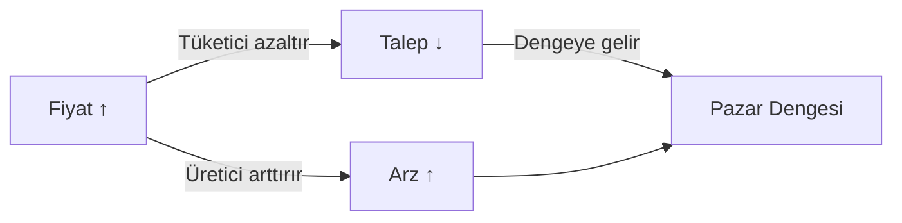

# 📚 **İKTİSAT DERSİ — DERİN ANLATIM**

---

## 🧠 **1. İktisadın Doğası ve Anlamı**

**İktisat**, sınırsız insan ihtiyaçlarını, **kıt kaynaklarla** en verimli şekilde karşılama bilimidir.
Kısaca:

> “Kıt kaynaklarla sonsuz isteği dengelemek.”

### 🔹 Temel Özellikler:

* **Kıtlık:** Her şeyden sonsuz miktarda yoktur.
* **Seçim:** Kaynaklar sınırlı → seçim yapmak zorundayız.
* **Fırsat Maliyeti (Opportunity Cost):**
  Bir şeyi seçtiğinde diğerinden vazgeçmenin maliyeti.
  Örn: Derse çalışırken dışarı çıkmaman → *“fırsat maliyeti eğlenme hakkın.”*

---

## ⚙️ **2. İktisadın Türleri**

| Alan                     | Kapsam                  | Amaç                                         |
| ------------------------ | ----------------------- | -------------------------------------------- |
| **Mikro İktisat**        | Bireyler, firmalar      | Fiyat, arz, talep, kâr analizi               |
| **Makro İktisat**        | Ekonomi geneli          | Enflasyon, işsizlik, büyüme, para politikası |
| **Uluslararası İktisat** | Dış ticaret, döviz      | Ülkeler arası ekonomik ilişkiler             |
| **Kamu İktisadı**        | Devlet müdahalesi       | Vergiler, kamu harcamaları                   |
| **Kalkınma İktisadı**    | Gelişmekte olan ülkeler | Gelir dağılımı, yoksulluk, sanayileşme       |
| **Davranışsal İktisat**  | Psikoloji + ekonomi     | İnsanların “mantıksız” ekonomik kararları    |

---

## 💸 **3. Temel Kavramlar**

### 🔹 Arz (Supply)

Üreticilerin belirli bir fiyattan piyasaya sunmak istedikleri mal miktarıdır.
**Kural:** Fiyat ↑ → Arz ↑

### 🔹 Talep (Demand)

Tüketicilerin belirli bir fiyattan almak istedikleri mal miktarıdır.
**Kural:** Fiyat ↑ → Talep ↓

### 📊 Arz ve Talep Dengesi

> **Denge Fiyatı (Equilibrium Price):**
> Arz = Talep olduğu noktadır.
> Bu noktada ne kıtlık ne fazlalık vardır.

---

## 🧮 **4. Üretim ve Verimlilik**

### 🔹 Üretim Faktörleri:

| Faktör              | Açıklama                   | Kazanç Türü |
| ------------------- | -------------------------- | ----------- |
| **Emek**            | İnsan gücü                 | Ücret       |
| **Sermaye**         | Makine, araç, bina         | Faiz        |
| **Doğal Kaynaklar** | Toprak, hammadde           | Rant        |
| **Girişimcilik**    | Üretimi organize eden kişi | Kâr         |

### 🔹 Verimlilik

Aynı kaynakla daha çok üretmek → **ekonomik büyümenin motoru.**

---

## 🏛️ **5. Ekonomik Sistemler**

| Sistem                | Özellik                         | Örnek           |
| --------------------- | ------------------------------- | --------------- |
| **Kapitalist Sistem** | Serbest piyasa, özel mülkiyet   | ABD             |
| **Sosyalist Sistem**  | Devlet planlaması, eşitlik      | Eski SSCB       |
| **Karma Sistem**      | Devlet + Özel sektör iş birliği | Türkiye, Fransa |

---

## 💹 **6. Makro İktisat Temelleri**

### 🔸 Milli Gelir (GDP / GSYH)

Bir ülkenin belli bir dönemde ürettiği mal ve hizmetlerin toplam değeridir.

> Formül: **Y = C + I + G + (X - M)**
> (Tüketim + Yatırım + Devlet Harcaması + Net İhracat)

### 🔸 Enflasyon

Genel fiyat düzeyinin sürekli artmasıdır.

* **Neden:** Fazla para arzı, maliyet artışı, talep fazlası.
* **Sonuç:** Paranın değeri düşer, alım gücü azalır.

### 🔸 İşsizlik

Çalışmak isteyen ama iş bulamayan nüfus.
**Türleri:**

* Friksiyonel (geçici)
* Yapısal (teknoloji değişimi)
* Konjonktürel (ekonomik daralma)

### 🔸 Para Politikası

Merkez Bankası tarafından yürütülür.
Amaç: Enflasyonu kontrol etmek, fiyat istikrarını sağlamak.
Araç: Faiz oranı, açık piyasa işlemleri.

---

## 🌍 **7. Uluslararası İktisat ve Küreselleşme**

### 🔹 Dış Ticaret

Ülkeler, **karşılaştırmalı üstünlük** ilkesine göre ticaret yapar.
Yani kim neyi daha verimli üretiyorsa onu yapmalı.

### 🔹 Döviz Kuru

Bir ülke parasının başka bir ülke parası cinsinden değeri.
Örn: 1 USD = 35 TL

**Kuru etkileyen faktörler:**

* Enflasyon
* Faiz oranı
* Cari açık
* Siyasi istikrar

---

## 🧭 **8. İktisadi Düşünce Tarihi**

| Dönem                       | Temsilciler               | Temel Görüş                               |
| --------------------------- | ------------------------- | ----------------------------------------- |
| **Klasikler** (1776–1870)   | Adam Smith, David Ricardo | Serbest piyasa, görünmez el               |
| **Neoklasikler**            | Alfred Marshall           | Marjinal fayda, birey temelli analiz      |
| **Keynesyenler** (1936–...) | John M. Keynes            | Devlet müdahalesi gereklidir              |
| **Monetaristler**           | Milton Friedman           | Para arzı ekonomiyi belirler              |
| **Yeni Klasikler**          | Lucas, Sargent            | Rasyonel beklentiler, mikro temelli makro |

---

## 🚀 **9. Günümüzde İktisat**

* **Davranışsal ekonomi:** İnsan kararları her zaman rasyonel değildir.
* **Dijital ekonomi:** Kripto paralar, yapay zekâ, otomasyon etkisi.
* **Sürdürülebilir ekonomi:** Çevre, enerji, karbon ayak izi artık ekonomik denklemde.
* **Veri ekonomisi:** Bilgi, yeni sermaye biçimi haline geldi.

---

## 🧩 **10. İktisat Neden Önemli?**

Çünkü iktisat **hayatın tamamına dokunur**:

* Ne üretileceğini,
* Nasıl üretileceğini,
* Kimin tüketeceğini belirler.

> “İktisat, sadece para değil; insan davranışının en matematiksel halidir.”

## 🧠 1. **İktisadın iki büyük cephesi**

İktisatı genelde ikiye ayırırız:

### **a. Mikro iktisat: bireylerin ve firmaların davranışı**

Burada incelenen şeyler:

* **Tüketici davranışı:** İnsanlar neden bazı ürünleri seçer, “fayda” nasıl ölçülür?
  (Örneğin: Kahve mi enerji içeceği mi? Bu karar gelirine, zevkine, ve fiyatlara göre değişir.)
* **Üretici davranışı:** Firmalar nasıl üretim kararı alır, maliyet nasıl minimize edilir?
* **Piyasa türleri:** Tam rekabet, tekel, oligopol gibi sistemler.

💬 Mikro iktisat → “Ben bu kahveyi neden aldım?”
(Basit ama derin bir soru aslında.)

---

### **b. Makro iktisat: ülke ekonomisinin büyük resmi**

* Milli gelir, işsizlik, enflasyon, büyüme, para politikası, maliye politikası…
* Devletin ekonomiye nasıl yön verdiği, merkez bankasının nasıl karar aldığı gibi konular burada.
* “Ekonomik kriz neden olur?” gibi sorular makro iktisadın alanıdır.

💬 Makro iktisat → “Ülke neden büyümüyor ve neden her şey pahalı?”

---

## 🧩 2. **İktisat yaklaşımları (okullar)**

Her dönemde farklı düşünce okulları çıkmış.
Kısaca birkaçını özetleyeyim:

* **Klasik iktisat (Adam Smith):**
  “Piyasa kendi kendine dengeye gelir.” Devlet karışmamalı.
  Görünmez el teorisi 👋

* **Keynesyen iktisat:**
  “Hayır kardeşim, kriz olunca devlet müdahale etmeli.”
  Keynes’e göre bazen piyasalar kendi başına dengeye gelemez.

* **Monetarizm (Milton Friedman):**
  “Para arzı her şeyin temelidir.”
  Enflasyon = çok fazla para dolaşımı.

* **Davranışsal iktisat:**
  İnsanlar her zaman rasyonel davranmaz, duygusal kararlar da ekonomiyi etkiler.
  (Mesela: indirim görünce gereksiz alışveriş yapmak 😂)

---

## 💵 3. **Temel kavramların arkası**

Biraz derin kavramlara bakalım:

* **Fırsat maliyeti:**
  Bir şeyi seçtiğinde diğer seçeneği kaybetmenin bedeli.
  (Örn: Ders çalışırken Netflix izlememek = kaybettiğin keyif fırsat maliyetidir.)

* **Marjinal fayda:**
  Bir şeyin *bir birim fazlasının* getirdiği ek tatmin.
  (İlk dilim pizza mükemmeldir, beşincide heyecan biter.)

* **Enflasyon – Deflasyon:**
  Enflasyon: fiyatlar genel düzeyi artıyor.
  Deflasyon: fiyatlar düşüyor ama işsizlik artabilir.

* **Faiz oranı:**
  Paranın zaman değeridir. Bugünkü 100 TL, yarının 100 TL’sinden değerlidir.

---

## 🌍 4. **Küresel ekonomi ve modern konular**

* **Küreselleşme:** Ülkeler birbirine ticaret ve sermaye ile bağlanıyor.
* **Kripto paralar:** Yeni bir para biçimi, klasik para teorilerine meydan okuyor.
* **Sürdürülebilir kalkınma:** Ekonomi sadece büyümemeli, çevre ve sosyal dengeyi de korumalı.
* **Dijital ekonomi:** Veriler, algoritmalar ve yapay zekâ ekonomik değer yaratıyor.

---

## 🔮 5. **İktisat neden önemli?**

Çünkü:

* Günlük hayatındaki her karar bir *iktisadi karardır.*
* Devletin kararları, maaşından kahve fiyatına kadar her şeyi etkiler.
* Yazılımcı olsan bile, ekonomi bilmek seni **daha stratejik düşünen bir insan** yapar — yatırım, girişimcilik, bütçe yönetimi hepsi ekonomiyle iç içe.

---
