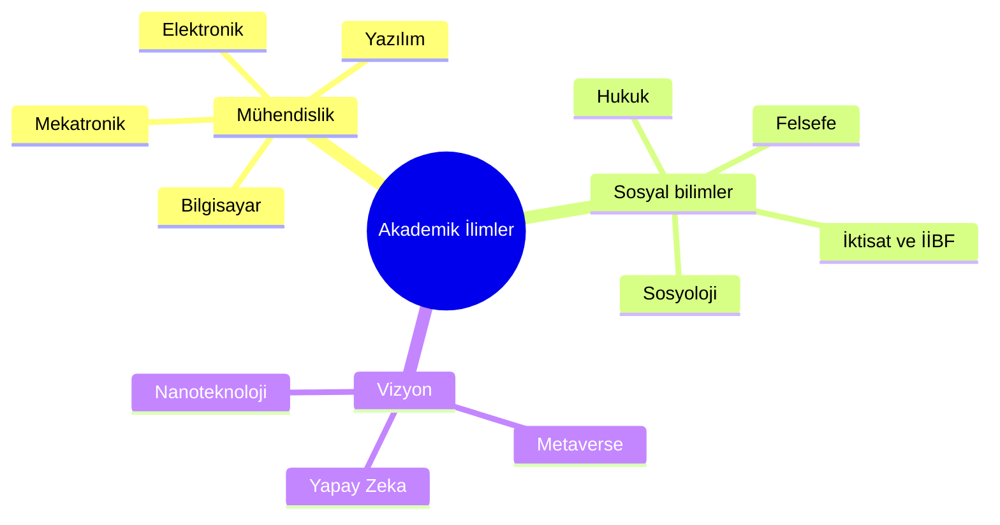

# 📚 Akademik Notlar ve Ders Arşivi


> *“Merak ettiklerimi not ettim; çünkü merak, öğrenmenin ilk kıvılcımıdır.”* ✨

Bu repo, **Mühendislik**, **Hukuk**, **İİBF** ve **Sosyal Bilimler** alanlarında üniversite dersleri ve kişisel çalışmalarım sırasında tuttuğum notlar, çözüm örnekleri ve araştırmalardan oluşur.
Tek bir disipline bağlı kalmadan, çok yönlü bir **öğrenme ve belgeleme** alanıdır. 🚀

---

## 📘 İçindekiler

* 🎯 Giriş ve Amaç
* 🗂️ Depo Yapısı
* 🧭 Nasıl Gezilir
* 🛣️ Yakında Eklenecekler (Roadmap)
* 🤝 Katkıda Bulunma
* ⚖️ Lisans
* ✍️ Hazırlayan

---

## 🎯 Giriş ve Amaç

Bu repoyu sadece ders geçmek için değil, **disiplinlerarası bir vizyon** kazanmak ve öğrendiklerimi açık biçimde paylaşmak için oluşturdum.
Teknik mühendislik bilgilerinden hukuki temellere, ekonomik modellerden gelecek vizyonuna kadar geniş bir yelpazeyi kapsar.

> Bilgi paylaştıkça çoğalır ve anlam kazanır. 🌱

---

## 🗂️ Depo Yapısı

Bu depo, akademik disiplinlere göre ana kategorilere ayrılmıştır. İşte genel yapı:



### 🏗️ Mühendislik Fakültesi (`mühendislik/`)
Mühendislik disiplinlerinin kalbi buradadır.
- **📁 mekatronik_mühendisligi/**: Robotik, kontrol ve otomasyon.
- **📁 bilgisayar_mühendisligi/**: Algoritmalar ve bilgisayar sistemleri.
- **📁 yazılım_mühendisligi/**: Yazılım mimarisi, tasarım ve geliştirme.
  - *Örn:* `veri_tabani/`, `yazilim_tasarim/`
- **📁 elektronik_haberlesme_muhendisligi/**: Devreler, sinyaller ve haberleşme.
  - *Örn:* `antenler_ve_propagasyon/`, `iletisim_elektronigi/`
- ve daha fazlası...

### ⚖️ Hukuk (`hukuk/`)
Hukuki formasyon ve temel kanun notları.
- **📁 medeni_hukuk/**

### 📈 İktisadi ve İdari Bilimler (`iibf/`)
Ekonomi ve yönetim bilimleri.
- **📁 iktisat/**
- **📁 işletme/**
- **📁 maliye/**

### 🧠 Sosyal ve Beşeri Bilimler (`sosyal_ve_beseri_bilimler/`)
İnsan ve toplum üzerine incelemeler.
- **📁 sosyoloji/**: Toplum bilimi.
- **📁 piskoloji/**: Zihin ve davranış.
- **📁 felsefe/**: Düşünce tarihi.
- **📁 ekonomi/**, **📁 dilbilim/** vb.

### 🚀 Vizyon ve Gelecek Teknolojileri (`vizyon/`)
Geleceği şekillendirecek teknolojiler üzerine araştırmalar.
- **📁 yapay_zeka/**, **📁 metaverse/**, **📁 bci/** (Beyin-Bilgisayar Arayüzleri)
- **📁 nanoteknoloji_ai/**, **📁 fintek_ai/**

---

## 🧭 Nasıl Gezilir

1. Repo köküne gidin:
   ```powershell
   cd "C:\github repolarım\engineering-courses"
   ```

2. İlgilenmek istediğiniz alana geçiş yapın. Örneğin **Elektronik ve Haberleşme** için:
   ```powershell
   cd "mühendislik/mekatronik_mühendisligi/elektronik_haberlesme_muhendisligi"
   ls
   ```

3. Notlar genellikle `.md` (Markdown), `.pdf` veya kod dosyaları şeklindedir.

---

## 🛣️ Yakında Eklenecekler (Roadmap)

🔜 Bu repo dinamik bir şekilde büyüyor. Planlananlar:

* 🧩 **Disiplinlerarası Projeler**: Hukuk ve Yapay Zeka'nın kesiştiği analizler.
* 📄 **Sınav Hazırlık Setleri**: Vize/Final çalışma notları.
* 🌍 **Global Kaynaklar**: İngilizce terimler sözlüğü.

---

## 🤝 Katkıda Bulunma

Her türlü katkıya açığız! Hata düzeltme, not ekleme veya yeni bir konu başlığı açma...
Lütfen [`CONTRIBUTING.md`](CONTRIBUTING.md) dosyasına göz atın.

---

## ⚖️ Lisans

Bu repo **MIT Lisansı** ile lisanslanmıştır. Detaylar için [`LICENSE`](LICENSE) dosyasına bakabilirsiniz.

---

## ✍️ Hazırlayan

**Bahattin Yunus Çetin**
🎓 Mühendislik & Multidisipliner Araştırmacı
💬 İlgi Alanları: Yapay Zekâ, Hukuk, Ekonomi, Felsefe

---

> 🌌 "Kainatın kitabı matematik diliyle yazılmıştır." - Galileo
> Ama onu anlamak için felsefe, anlatmak için hukuk ve yönetmek için iktisat gerekir.
