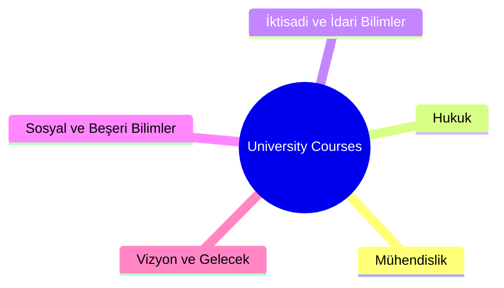

# 🎓 University Courses — Akademik Notlar ve Ders Arşivi


> *“Kainatın kitabı matematik diliyle yazılmıştır ama onu anlamak için felsefe, anlatmak için hukuk ve yönetmek için iktisat gerekir.”* ✨

Bu repo, **Mühendislik**, **Hukuk**, **İİBF** ve **Sosyal Bilimler** gibi farklı akademik disiplinleri tek bir çatıda toplayan kapsamlı bir ders arşividir. Notlar, ödevler, projeler ve kişisel araştırmalar burada düzenli bir şekilde saklanır.
Amaç sadece ders geçmek değil; **disiplinlerarası bir vizyon** kazanmaktır. 🚀

---

## 📘 İçindekiler

* 🎯 Giriş ve Vizyon
* 🗂️ Depo Yapısı (Ders Listesi)
* 🧭 Nasıl Gezilir
* 🛣️ Yakında Eklenecekler (Roadmap)
* 🤝 Katkıda Bulunma
* ⚖️ Lisans

---

## 🎯 Giriş ve Vizyon

Bu repo, üniversite eğitimim boyunca ve sonrasında edindiğim bilgilerin dijital bir kütüphanesidir.
Teknik bir mühendisin analitik zekası ile bir hukukçunun adalet arayışını, bir ekonomistin stratejik bakışını ve bir sosyoloğun toplum analizini bir araya getirmeyi hedefler.

> **Bilgi paylaştıkça çoğalır.** 🌱

---

## 🗂️ Depo Yapısı (Ders Listesi)

Akademik literatüre uygun olarak kategorize edilmiştir:



### 🏗️ Mühendislik Fakültesi (`mühendislik/`)
Teknoloji ve inovasyonun kalbi.
- **📁 mekatronik_mühendisligi/**: Robotik, PLC, Otomasyon.
- **📁 bilgisayar_mühendisligi/**: Veri yapıları, Algoritmalar.
- **📁 yazılım_mühendisligi/**:
    - `veri_tabani` (SQL, NoSQL)
    - `yazilim_tasarim_mimarisi`
- **📁 elektronik_haberlesme_muhendisligi/**:
    - `antenler_ve_propagasyon`
    - `iletisim_elektronigi`
    - `analog_haberlesme`
    - `sayisal_isaret_isleme`
- **📁 elektrik_elektronik_muhendisligi/**: Devre teorileri.
- **📁 endustriyel_tasarim_muhendisligi/**: Tasarım prensipleri.
- **Genel Dersler:** `fizik/`, `matematik/`, `kimya/`, `biyoloji/`, `mantik/`.

### ⚖️ Hukuk Fakültesi (`hukuk/`)
Adalet ve mevzuat bilgisi.
- **📁 medeni_hukuk/**

### 📈 İktisadi ve İdari Bilimler Fakültesi (`iibf/`)
Ekonomi, yönetim ve finans.
- **📁 iktisat/**
- **📁 işletme/**
- **📁 maliye/**

### 🧠 Sosyal ve Beşeri Bilimler (`sosyal_ve_beseri_bilimler/`)
İnsan, toplum ve düşünce.
- **📁 sosyoloji/**
- **📁 piskoloji/**
- **📁 felsefe/**
- **📁 antropoloji/**
- **📁 dilbilim/**
- **📁 ekonomi/** (Teori)

### 🚀 Vizyon ve Gelecek Teknolojileri (`vizyon/`)
Geleceği şekillendiren ileri teknolojiler.
- **📁 yapay_zeka/**, **📁 metaverse/**
- **📁 bci/** (Beyin-Bilgisayar Arayüzleri)
- **📁 nanoteknoloji_ai/**, **📁 biyoteknik_nanotıp/**
- **📁 fintek_ai/**, **📁 3d_print_ai/**

---

## 🧭 Nasıl Gezilir

1. Projeyi bilgisayarınıza çekin:
   ```powershell
   git clone https://github.com/bahattinyunus/university-courses.git
   cd "university-courses"
   ```

2. İlgili fakülte ve bölüme gidin:
   ```powershell
   cd "mühendislik/mekatronik_mühendisligi"
   ```

3. İçerikler genellikle `.md` notları, `.pdf` kaynakları veya `.py/.cpp` kodlarıdır.

---

## 🛣️ Yakında Eklenecekler (Roadmap)

🔜 Gelecek planları:

* 🧩 **Disiplinlerarası Vaka Analizleri**: Hukuk ve AI etiği üzerine çalışmalar.
* 📄 **Sınav Arşivi**: Geçmiş yılların vize/final soruları.
* 🌍 **İngilizce-Türkçe Sözlük**: Teknik terimler için.

---

## 🤝 Katkıda Bulunma

Bu açık kaynaklı bir projedir. Katkılarınızı bekliyoruz!
Lütfen [`CONTRIBUTING.md`](CONTRIBUTING.md) dosyasına göz atın.

---

## ⚖️ Lisans

Bu repo **MIT Lisansı** ile korunmaktadır. Detaylar için [`LICENSE`](LICENSE) dosyasına bakabilirsiniz.

---

## ✍️ Hazırlayan

**Bahattin Yunus Çetin**
🎓 Mühendislik & Multidisipliner Araştırmacı
