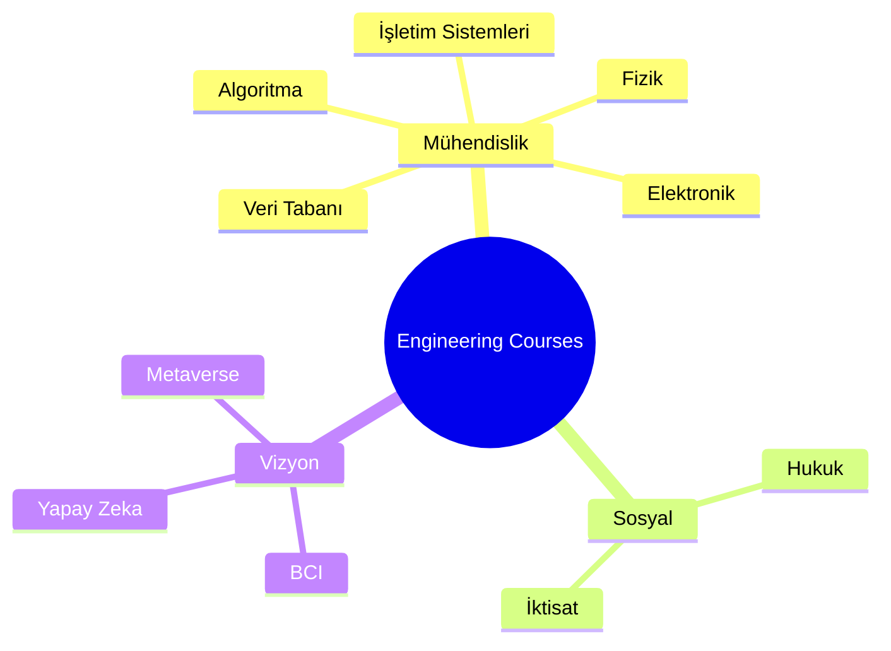

#  engineering-courses — Ders Notları & Kişisel Notlar


> *“Merak ettiklerimi not ettim; çünkü merak, öğrenmenin ilk kıvılcımıdır.”* ✨

Bu repo, **üniversite dersleri** ve **kişisel çalışmalarım** sırasında tuttuğum notlar, çözüm örnekleri ve özetlerden oluşur.
İçerikler **Türkçe** hazırlanmıştır ve zamanla yeni dersler eklenecektir — yani bu depo **canlı bir öğrenme alanıdır!** 🚀

---

## 📘 İçindekiler

* 🎯 Giriş ve Amaç
* 🗂️ Depo Yapısı
* 🧭 Nasıl Gezilir
* 🛣️ Yakında Eklenecekler (Roadmap)
* 🤝 Katkıda Bulunma
* ⚖️ Lisans
* ✍️ Hazırlayan

---

## 🎯 Giriş ve Amaç

Bu repoyu sadece ders geçmek için değil, **anlayarak öğrenmek** ve öğrendiklerimi açık biçimde paylaşmak için oluşturdum.
Amaç; teknik konularda güçlü bir temel oluştururken, aynı zamanda öğrenme sürecini belgelendirmek.

> Bilgi biriktirmek güzel ama paylaşmak **daha da kalıcı** hale getiriyor. 🌱

---

## 🗂️ Depo Yapısı

Her klasör bir dersi temsil eder ve içinde notlar, örnekler, PDF'ler veya kısa açıklamalar bulunur.




### 📚 Temel Mühendislik Dersleri

```
📦 engineering-courses
 ┣ 📁 algoritma/                    # Algoritma ve veri yapıları
 ┣ 📁 analog_elektronik/           # Analog elektronik devreler
 ┣ 📁 analog_haberlesme/            # Analog haberleşme sistemleri
 ┣ 📁 Antenler_Propagasyon/         # Antenler ve dalga yayılımı
 ┣ 📁 betik_diller/                # Scripting languages (Python, Bash, vb.)
 ┣ 📁 bicimsel_diller_otamata_teorisi/  # Formal languages & automata
 ┣ 📁 elektrik_motorları/          # Elektrik motorları
 ┣ 📁 elektronik_devreler/          # Elektronik devre analizi
 ┣ 📁 fizik/                       # Fizik temelleri
 ┣ 📁 görüntü_isleme/              # Görüntü işleme ve computer vision
 ┣ 📁 İLETİŞİM_elektroniği/        # İletişim elektroniği
 ┣ 📁 işletim_sistemleri/           # Operating systems
 ┣ 📁 Sayısal_İşaret_İşleme/       # Digital signal processing
 ┣ 📁 sayısal_tasarım/              # Digital design
 ┣ 📁 sistem_programlama/           # System programming
 ┣ 📁 veri tabanı/                  # Database systems
 ┗ 📁 yazılım_tasarım_mimarisi/     # Software design & architecture
```

### 🎓 Sosyal ve Disiplinlerarası Dersler

```
 ┣ 📁 hukuk/                       # Hukuk dersleri
 ┃  ┗ 📁 medeni_hukuk/            # Medeni hukuk
 ┗ 📁 iktisat/                    # İktisat dersleri
    ├ 📄 ek.md
    ├ 📄 grafik.md
    ├ 📄 readme.md
    ┗ 📄 sozluk.md
```

### 🚀 Vizyon ve Gelecek Teknolojileri

```
 ┗ 📁 vizyon/                      # Gelecek teknolojileri ve vizyon
    ├ 📁 3d_print_ai/             # 3D printing & AI
    ├ 📁 bcı/                      # Brain-computer interface
    ├ 📁 biyoteknik_nanotıp/      # Biyoteknik & nanoteknoloji
    ├ 📁 contex_engineering/      # Context engineering
    ├ 📁 fintek_ai/                # Fintech & AI
    ├ 📁 metaverse/                # Metaverse teknolojileri
    ├ 📁 nanateknoloji_ai/         # Nanotechnology & AI
    ┗ 📄 readme.md
```

> Her klasörde varsa kendi `README.md` dosyasına göz atın — konuya özel açıklamalar, görseller ve kaynaklar oradadır.

### 💻 Kod Örnekleri

Bazı klasörlerde `examples/` klasörü içinde konuyla ilgili kod örnekleri bulunmaktadır:

- **algoritma/examples/** - Python algoritma örnekleri (Bubble Sort, Binary Search, vb.)
- **betik_diller/examples/** - Python ve Bash script örnekleri
- **veri tabanı/examples/** - SQL sorgu örnekleri
- **fizik/examples/** - Fizik hesaplama kodları
- **görüntü_isleme/examples/** - OpenCV görüntü işleme örnekleri

> Kod örnekleri eğitim amaçlıdır ve doğrudan çalıştırılabilir. Her örnek için `README.md` dosyasında detaylı açıklamalar bulunmaktadır.

---

## 🧭 Nasıl Gezilir

1. Repo köküne gidin:

   ```powershell
   cd "C:\github repolarım\engineering-courses"
   ```

2. İlgili klasöre geçin ve içeriğe göz atın:

   ```powershell
   cd analog_elektronik
   ls
   ```

3. Notlar `.md`, `.pdf` veya örnek kod dosyaları şeklinde olabilir.

---

## 🛣️ Yakında Eklenecekler (Roadmap)

🔜 Bu repo dinamik bir şekilde büyüyor. Yakında eklenecek içerikler:

* 🧩 Her klasöre kısa **ders kartları (özet notlar)**
* 📄 Örnek sınav soruları ve çözümleri
* 💡 Ders içi mini projeler (kod + devre şeması)
* 🌍 İngilizce özetler (isteğe bağlı)
* 🧠 Hukuk, sosyoloji ve yapay zekâ temalı ek bölümler

> Yeni bölümler eklendikçe tarih ve açıklama burada listelenecektir.
> Katkı yapmak istersen, roadmap’e fikir ekleyebilirsin! 🗺️

---

## 🤝 Katkıda Bulunma

Bu repository açık kaynaklıdır ve katkılarınızı bekliyoruz! 🌟

* Hatalı bilgi, eksik içerik veya eklemek istediğiniz materyal mi var?
  → **Issue açın** veya **Pull Request** gönderin.
* Küçük düzenlemeler için doğrudan PR,
  büyük içerik değişiklikleri için önce tartışma açmanız önerilir.

Detaylı katkı rehberi için [`CONTRIBUTING.md`](CONTRIBUTING.md) dosyasına bakabilirsiniz. ⚙️

---

## ⚖️ Lisans

Bu repo **eğitim ve paylaşım amacıyla** hazırlanmıştır.
Lisans olarak `MIT` kullanılmaktadır.
Detaylar için `LICENSE` dosyasına bakabilirsiniz. 🧾

---

## ✍️ Hazırlayan

**Bahattin Yunus Çetin**
🎓 Yazılım Mühendisliği Öğrencisi
💬 İlgi Alanları: Yapay Zekâ, Hukuk, Veri Bilimi

---

> 🧠 “Bilim, sadece öğrenmekle değil; anlamakla başlar.”
> Bu repo, o anlamın izini süren bir yolculuğun not defteri. 🌌
